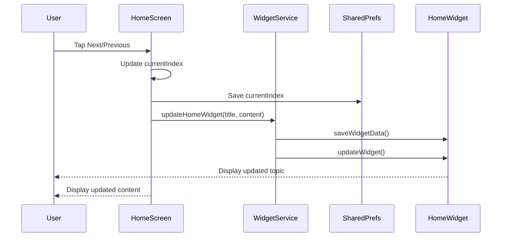

# Design Document: DSA Revision App

## Overview

The DSA Revision App is a Flutter mobile application that provides an interactive learning experience for Data Structures and Algorithms concepts. The app renders markdown-formatted content with simple navigation controls and integrates with Android home screen widgets to provide quick access to study materials.

The design follows a straightforward architecture using Flutter's StatefulWidget for state management, avoiding complex state management solutions. The app uses the home_widget package to synchronize the current topic with an Android home screen widget, allowing users to view their current study topic without opening the app.

### Key Design Decisions

1. **StatefulWidget over complex state management**: Keeps the codebase simple and maintainable for this focused use case
2. **Mock data initially**: Allows rapid development and testing without filesystem complexity
3. **SharedPreferences for persistence**: Lightweight solution for storing current index and widget data
4. **home_widget package**: Proven solution for Flutter-to-Android widget communication
5. **Material 3**: Modern design system with built-in dark mode support

## Architecture

The application follows a simple three-layer architecture:

```
┌─────────────────────────────────────┐
│         Presentation Layer          │
│  (home_screen.dart - StatefulWidget)│
│   - Markdown rendering              │
│   - Navigation controls             │
│   - UI state management             │
└──────────────┬──────────────────────┘
               │
               ↓
┌─────────────────────────────────────┐
│         Service Layer               │
│     (widget_service.dart)           │
│   - Widget data synchronization     │
│   - SharedPreferences operations    │
│   - HomeWidget API calls            │
└──────────────┬──────────────────────┘
               │
               ↓
┌─────────────────────────────────────┐
│         Data Layer                  │
│        (Mock data in code)          │
│   - Hardcoded DSA topics            │
│   - Title and content pairs         │
└─────────────────────────────────────┘
```

### Component Interaction Flow



## Components and Interfaces

### 1. Main Application (main.dart)

**Responsibility**: Application entry point and initialization

```dart
void main() async {
  WidgetsFlutterBinding.ensureInitialized();
  await HomeWidget.registerBackgroundCallback(backgroundCallback);
  runApp(const DSARevisionApp());
}

class DSARevisionApp extends StatelessWidget {
  Widget build(BuildContext context) {
    return MaterialApp(
      title: 'DSA Revision',
      theme: ThemeData.light(useMaterial3: true),
      darkTheme: ThemeData.dark(useMaterial3: true),
      themeMode: ThemeMode.system,
      home: const HomeScreen(),
    );
  }
}
```

**Key Operations**:
- Initialize Flutter bindings
- Register home_widget background callback
- Configure Material 3 themes (light and dark)
- Set system theme mode for automatic dark mode

### 2. Home Screen (home_screen.dart)

**Responsibility**: Main UI and navigation logic

**State Variables**:
```dart
class _HomeScreenState extends State<HomeScreen> {
  int currentIndex = 0;
  final List<Map<String, String>> dsaNotes = [...];
  
  @override
  void initState() {
    super.initState();
    _loadCurrentIndex();
  }
}
```

**Key Methods**:

```dart
// Load persisted index on startup
Future<void> _loadCurrentIndex() async {
  final prefs = await SharedPreferences.getInstance();
  final savedIndex = prefs.getInt('currentIndex') ?? 0;
  setState(() {
    currentIndex = savedIndex;
  });
  _updateWidget();
}

// Navigate to next topic
void _goToNext() {
  if (currentIndex < dsaNotes.length - 1) {
    setState(() {
      currentIndex++;
    });
    _saveAndUpdateWidget();
  }
}

// Navigate to previous topic
void _goToPrevious() {
  if (currentIndex > 0) {
    setState(() {
      currentIndex--;
    });
    _saveAndUpdateWidget();
  }
}

// Save index and update widget
Future<void> _saveAndUpdateWidget() async {
  final prefs = await SharedPreferences.getInstance();
  await prefs.setInt('currentIndex', currentIndex);
  await _updateWidget();
}

// Synchronize with home widget
Future<void> _updateWidget() async {
  final topic = dsaNotes[currentIndex];
  await updateHomeWidget(
    topic['title']!,
    topic['content']!,
  );
}
```

**UI Structure**:
```dart
Widget build(BuildContext context) {
  return Scaffold(
    appBar: AppBar(
      title: Text(dsaNotes[currentIndex]['title']!),
    ),
    body: Column(
      children: [
        // Scrollable markdown content
        Expanded(
          child: Markdown(
            data: dsaNotes[currentIndex]['content']!,
            selectable: true,
          ),
        ),
        // Navigation buttons
        Padding(
          padding: const EdgeInsets.all(16.0),
          child: Row(
            mainAxisAlignment: MainAxisAlignment.spaceBetween,
            children: [
              ElevatedButton(
                onPressed: currentIndex > 0 ? _goToPrevious : null,
                child: const Text('Previous'),
              ),
              Text('${currentIndex + 1} / ${dsaNotes.length}'),
              ElevatedButton(
                onPressed: currentIndex < dsaNotes.length - 1 
                    ? _goToNext 
                    : null,
                child: const Text('Next'),
              ),
            ],
          ),
        ),
      ],
    ),
  );
}
```

### 3. Widget Service (widget_service.dart)

**Responsibility**: Synchronize app state with Android home widget

```dart
// Update home widget with current topic
Future<void> updateHomeWidget(String title, String content) async {
  try {
    // Extract preview (first 150 characters)
    final preview = _extractPreview(content, maxLength: 150);
    
    // Save data for widget
    await HomeWidget.saveWidgetData<String>('widget_title', title);
    await HomeWidget.saveWidgetData<String>('widget_content', preview);
    
    // Trigger widget update
    await HomeWidget.updateWidget(
      name: 'DSAWidgetProvider',
      androidName: 'DSAWidgetProvider',
    );
  } catch (e) {
    print('Error updating widget: $e');
  }
}

// Extract plain text preview from markdown
String _extractPreview(String markdown, {int maxLength = 150}) {
  // Remove markdown headers
  String preview = markdown.replaceAll(RegExp(r'^#+\s+', multiLine: true), '');
  
  // Remove markdown formatting
  preview = preview.replaceAll(RegExp(r'[*_`]'), '');
  
  // Take first maxLength characters
  if (preview.length > maxLength) {
    preview = preview.substring(0, maxLength) + '...';
  }
  
  return preview.trim();
}

// Background callback for widget interactions (future use)
@pragma('vm:entry-point')
void backgroundCallback(Uri? uri) {
  // Handle widget taps or other interactions
  // Currently not used, but required by home_widget
}
```

### 4. Android Widget Configuration

**AndroidManifest.xml additions**:
```xml
<receiver
    android:name="DSAWidgetProvider"
    android:exported="true">
    <intent-filter>
        <action android:name="android.appwidget.action.APPWIDGET_UPDATE" />
    </intent-filter>
    <meta-data
        android:name="android.appwidget.provider"
        android:resource="@xml/dsa_widget_info" />
</receiver>
```

**Widget Info (res/xml/dsa_widget_info.xml)**:
```xml
<?xml version="1.0" encoding="utf-8"?>
<appwidget-provider
    xmlns:android="http://schemas.android.com/apk/res/android"
    android:minWidth="250dp"
    android:minHeight="110dp"
    android:updatePeriodMillis="0"
    android:initialLayout="@layout/dsa_widget_layout"
    android:resizeMode="horizontal|vertical"
    android:widgetCategory="home_screen" />
```

**Widget Layout (res/layout/dsa_widget_layout.xml)**:
```xml
<?xml version="1.0" encoding="utf-8"?>
<LinearLayout
    xmlns:android="http://schemas.android.com/apk/res/android"
    android:layout_width="match_parent"
    android:layout_height="match_parent"
    android:orientation="vertical"
    android:padding="16dp"
    android:background="@drawable/widget_background">

    <TextView
        android:id="@+id/widget_title"
        android:layout_width="match_parent"
        android:layout_height="wrap_content"
        android:text="DSA Topic"
        android:textSize="18sp"
        android:textStyle="bold"
        android:textColor="#FFFFFF"
        android:maxLines="1"
        android:ellipsize="end" />

    <TextView
        android:id="@+id/widget_content"
        android:layout_width="match_parent"
        android:layout_height="wrap_content"
        android:layout_marginTop="8dp"
        android:text="Content preview..."
        android:textSize="14sp"
        android:textColor="#E0E0E0"
        android:maxLines="3"
        android:ellipsize="end" />

</LinearLayout>
```

**Widget Provider (Kotlin - android/app/src/main/kotlin/.../DSAWidgetProvider.kt)**:
```kotlin
class DSAWidgetProvider : AppWidgetProvider() {
    override fun onUpdate(
        context: Context,
        appWidgetManager: AppWidgetManager,
        appWidgetIds: IntArray
    ) {
        for (appWidgetId in appWidgetIds) {
            val widgetData = HomeWidgetPlugin.getData(context)
            val views = RemoteViews(context.packageName, R.layout.dsa_widget_layout)
            
            val title = widgetData.getString("widget_title", "DSA Revision")
            val content = widgetData.getString("widget_content", "Open app to view content")
            
            views.setTextViewText(R.id.widget_title, title)
            views.setTextViewText(R.id.widget_content, content)
            
            // Set click intent to open app
            val intent = Intent(context, MainActivity::class.java)
            val pendingIntent = PendingIntent.getActivity(
                context, 0, intent, PendingIntent.FLAG_UPDATE_CURRENT or PendingIntent.FLAG_IMMUTABLE
            )
            views.setOnClickPendingIntent(R.id.widget_title, pendingIntent)
            
            appWidgetManager.updateAppWidget(appWidgetId, views)
        }
    }
}
```

## Data Models

### Topic Data Structure

```dart
// Mock data structure
final List<Map<String, String>> dsaNotes = [
  {
    "title": "Arrays",
    "content": """# Arrays

Arrays are contiguous memory data structures that store elements of the same type.

## Key Properties
- Fixed size (in most languages)
- O(1) random access
- O(n) insertion/deletion (except at end)

## Common Operations
- Access: `arr[i]`
- Traverse: `for (int i = 0; i < n; i++)`
- Search: Linear O(n) or Binary O(log n) if sorted

## Use Cases
- When you need fast random access
- When size is known in advance
- Implementing other data structures (stacks, queues)
"""
  },
  {
    "title": "Strings",
    "content": """# Strings

Strings are sequences of characters, typically immutable in most languages.

## Key Properties
- Immutable (in Java, Python, etc.)
- Character array under the hood
- O(n) concatenation in immutable strings

## Common Operations
- Length: `str.length()`
- Substring: `str.substring(start, end)`
- Concatenation: `str1 + str2`
- Comparison: `str1.equals(str2)`

## Common Patterns
- Two pointers
- Sliding window
- String matching (KMP, Rabin-Karp)

## Use Cases
- Text processing
- Pattern matching
- Parsing
"""
  },
  {
    "title": "Linked List",
    "content": """# Linked List

A linked list is a linear data structure where elements are stored in nodes, each pointing to the next node.

## Types
- Singly Linked List
- Doubly Linked List
- Circular Linked List

## Key Properties
- Dynamic size
- O(1) insertion/deletion at known position
- O(n) random access

## Node Structure
\`\`\`
class Node {
    int data;
    Node next;
}
\`\`\`

## Common Operations
- Insert at head: O(1)
- Insert at tail: O(n) or O(1) with tail pointer
- Delete: O(n) to find, O(1) to remove
- Traverse: O(n)

## Use Cases
- When frequent insertions/deletions needed
- When size is unknown
- Implementing stacks, queues, graphs
"""
  }
];
```

### Widget Data Model

```dart
// Data synchronized with home widget
class WidgetData {
  final String title;      // Topic title
  final String content;    // Preview text (first 150 chars)
  
  // Stored in SharedPreferences via HomeWidget.saveWidgetData
  // Keys: 'widget_title', 'widget_content'
}
```

### Persistence Model

```dart
// Data persisted in SharedPreferences
class PersistedState {
  final int currentIndex;  // Key: 'currentIndex'
  
  // Loaded on app startup
  // Saved on every navigation
}
```

## Correctness Properties

*A property is a characteristic or behavior that should hold true across all valid executions of a system—essentially, a formal statement about what the system should do. Properties serve as the bridge between human-readable specifications and machine-verifiable correctness guarantees.*


### Property 1: Navigation Updates Index and Content

*For any* valid current index in the topic list, when the user navigates Next (if not at the end) or Previous (if not at the start), the current index should change by ±1 and the displayed title and content should match the topic at the new index.

**Validates: Requirements 2.2, 2.3, 2.6**

### Property 2: Index Persistence Round-Trip

*For any* valid topic index, if the app saves that index to SharedPreferences and then restarts, the app should load and display the same index.

**Validates: Requirements 4.1, 4.2**

### Property 3: Widget Data Synchronization

*For any* navigation action that changes the current topic, the widget service should save the new topic's title and content preview to HomeWidget storage and trigger a widget update.

**Validates: Requirements 6.1, 6.2, 6.3**

### Property 4: Content Preview Extraction

*For any* markdown content string, the preview extraction function should return a plain text string with markdown formatting removed, limited to the specified maximum length, with ellipsis appended if truncated.

**Validates: Requirements 5.2**

### Property 5: Index Boundaries

*For any* topic list, when the current index is 0, the Previous button should be disabled, and when the current index is at the last position, the Next button should be disabled.

**Validates: Requirements 2.4, 2.5** (edge cases)

## Error Handling

### Navigation Errors

**Out of Bounds Protection**:
- Next button is disabled when `currentIndex >= dsaNotes.length - 1`
- Previous button is disabled when `currentIndex <= 0`
- Navigation methods check bounds before updating state
- No exceptions thrown for boundary conditions

### Persistence Errors

**SharedPreferences Failures**:
```dart
Future<void> _loadCurrentIndex() async {
  try {
    final prefs = await SharedPreferences.getInstance();
    final savedIndex = prefs.getInt('currentIndex') ?? 0;
    
    // Validate loaded index is within bounds
    if (savedIndex >= 0 && savedIndex < dsaNotes.length) {
      setState(() {
        currentIndex = savedIndex;
      });
    } else {
      // Invalid saved index, reset to 0
      setState(() {
        currentIndex = 0;
      });
    }
  } catch (e) {
    print('Error loading index: $e');
    // Default to first topic on error
    setState(() {
      currentIndex = 0;
    });
  }
  _updateWidget();
}
```

**Save Failures**:
- Log errors but don't block UI updates
- App continues to function even if persistence fails
- Widget updates are attempted but failures are caught

### Widget Update Errors

**HomeWidget API Failures**:
```dart
Future<void> updateHomeWidget(String title, String content) async {
  try {
    final preview = _extractPreview(content, maxLength: 150);
    await HomeWidget.saveWidgetData<String>('widget_title', title);
    await HomeWidget.saveWidgetData<String>('widget_content', preview);
    await HomeWidget.updateWidget(
      name: 'DSAWidgetProvider',
      androidName: 'DSAWidgetProvider',
    );
  } catch (e) {
    // Log error but don't crash app
    print('Error updating widget: $e');
    // Widget will show stale data, but app continues working
  }
}
```

**Graceful Degradation**:
- If widget updates fail, the main app continues to function
- Widget shows last successfully updated data
- No user-facing error messages for widget failures

### Empty or Invalid Data

**Empty Topic List**:
- App should not be initialized with empty `dsaNotes` list
- Minimum 1 topic required (enforced by mock data)
- If list becomes empty (future file-based implementation), show error screen

**Invalid Markdown**:
- flutter_markdown handles invalid markdown gracefully
- Malformed markdown is rendered as plain text
- No crashes from markdown parsing errors

### State Consistency

**Async Operation Ordering**:
- Use `await` to ensure operations complete in order
- Save to SharedPreferences before updating widget
- Widget updates use latest saved data

**Race Conditions**:
- Navigation methods are not async, preventing rapid-tap issues
- setState is synchronous, ensuring UI updates immediately
- Only persistence and widget updates are async

## Testing Strategy

### Dual Testing Approach

The testing strategy employs both unit tests and property-based tests to ensure comprehensive coverage:

- **Unit tests**: Verify specific examples, edge cases, configuration, and error conditions
- **Property tests**: Verify universal properties across randomized inputs

### Property-Based Testing Configuration

**Library**: Use `flutter_test` with custom property test helpers or a package like `test_api` with custom generators

**Configuration**:
- Minimum 100 iterations per property test
- Each property test references its design document property
- Tag format: `// Feature: dsa-revision-app, Property {number}: {property_text}`

**Property Test Implementation**:

```dart
// Property 1: Navigation Updates Index and Content
// Feature: dsa-revision-app, Property 1: Navigation updates index and content
testWidgets('Property 1: Navigation updates index and content', (tester) async {
  // Run 100 iterations with different starting indices
  for (int iteration = 0; iteration < 100; iteration++) {
    final startIndex = iteration % dsaNotes.length;
    
    // Set up widget with specific starting index
    await tester.pumpWidget(createTestApp(initialIndex: startIndex));
    await tester.pumpAndSettle();
    
    // Test Next navigation (if not at end)
    if (startIndex < dsaNotes.length - 1) {
      await tester.tap(find.text('Next'));
      await tester.pumpAndSettle();
      
      // Verify index incremented and content updated
      expect(find.text(dsaNotes[startIndex + 1]['title']!), findsOneWidget);
      expect(find.textContaining(dsaNotes[startIndex + 1]['content']!.substring(0, 20)), findsOneWidget);
    }
    
    // Test Previous navigation (if not at start)
    if (startIndex > 0) {
      await tester.tap(find.text('Previous'));
      await tester.pumpAndSettle();
      
      // Verify index decremented and content updated
      expect(find.text(dsaNotes[startIndex - 1]['title']!), findsOneWidget);
    }
  }
});

// Property 2: Index Persistence Round-Trip
// Feature: dsa-revision-app, Property 2: Index persistence round-trip
test('Property 2: Index persistence round-trip', () async {
  // Run 100 iterations with different indices
  for (int iteration = 0; iteration < 100; iteration++) {
    final testIndex = iteration % dsaNotes.length;
    
    // Save index
    final prefs = await SharedPreferences.getInstance();
    await prefs.setInt('currentIndex', testIndex);
    
    // Simulate app restart by loading index
    final loadedIndex = prefs.getInt('currentIndex') ?? 0;
    
    // Verify round-trip
    expect(loadedIndex, equals(testIndex));
  }
});

// Property 4: Content Preview Extraction
// Feature: dsa-revision-app, Property 4: Content preview extraction
test('Property 4: Content preview extraction', () {
  // Test with various markdown strings
  final testCases = [
    '# Header\n\nSome content here',
    '**Bold** and *italic* text',
    'A very long string that exceeds the maximum length limit and should be truncated with ellipsis at the end',
    'Short text',
    '```code block```\nWith text',
  ];
  
  for (final content in testCases) {
    for (int maxLen in [50, 100, 150, 200]) {
      final preview = _extractPreview(content, maxLength: maxLen);
      
      // Verify properties
      expect(preview.length, lessThanOrEqualTo(maxLen + 3)); // +3 for '...'
      expect(preview.contains('#'), isFalse); // No markdown headers
      expect(preview.contains('**'), isFalse); // No bold markers
      expect(preview.contains('*'), isFalse); // No italic markers
      expect(preview.contains('```'), isFalse); // No code block markers
      
      if (content.length > maxLen) {
        expect(preview.endsWith('...'), isTrue);
      }
    }
  }
});
```

### Unit Testing Focus

**Specific Examples**:
```dart
testWidgets('App displays first topic on launch', (tester) async {
  await tester.pumpWidget(const DSARevisionApp());
  await tester.pumpAndSettle();
  
  expect(find.text('Arrays'), findsOneWidget);
  expect(find.text('Previous'), findsOneWidget);
  expect(find.text('Next'), findsOneWidget);
});

testWidgets('Navigation buttons exist', (tester) async {
  await tester.pumpWidget(const DSARevisionApp());
  await tester.pumpAndSettle();
  
  expect(find.widgetWithText(ElevatedButton, 'Previous'), findsOneWidget);
  expect(find.widgetWithText(ElevatedButton, 'Next'), findsOneWidget);
});

test('Mock data has at least 3 topics', () {
  expect(dsaNotes.length, greaterThanOrEqualTo(3));
  expect(dsaNotes[0]['title'], equals('Arrays'));
  expect(dsaNotes[1]['title'], equals('Strings'));
  expect(dsaNotes[2]['title'], equals('Linked List'));
});
```

**Edge Cases**:
```dart
testWidgets('Previous button disabled at first topic', (tester) async {
  await tester.pumpWidget(const DSARevisionApp());
  await tester.pumpAndSettle();
  
  final previousButton = tester.widget<ElevatedButton>(
    find.widgetWithText(ElevatedButton, 'Previous')
  );
  expect(previousButton.onPressed, isNull);
});

testWidgets('Next button disabled at last topic', (tester) async {
  await tester.pumpWidget(createTestApp(initialIndex: dsaNotes.length - 1));
  await tester.pumpAndSettle();
  
  final nextButton = tester.widget<ElevatedButton>(
    find.widgetWithText(ElevatedButton, 'Next')
  );
  expect(nextButton.onPressed, isNull);
});

test('Default to index 0 when no saved index exists', () async {
  final prefs = await SharedPreferences.getInstance();
  await prefs.clear();
  
  final loadedIndex = prefs.getInt('currentIndex') ?? 0;
  expect(loadedIndex, equals(0));
});
```

**Configuration Tests**:
```dart
test('home_widget package is in dependencies', () {
  // Verify pubspec.yaml contains home_widget
  final pubspec = File('pubspec.yaml').readAsStringSync();
  expect(pubspec.contains('home_widget:'), isTrue);
});

test('Material 3 is configured', () {
  final app = DSARevisionApp();
  final materialApp = app.build(MockBuildContext()) as MaterialApp;
  
  expect(materialApp.theme?.useMaterial3, isTrue);
  expect(materialApp.darkTheme?.useMaterial3, isTrue);
});
```

**Error Handling Tests**:
```dart
test('Widget update handles errors gracefully', () async {
  // Mock HomeWidget to throw error
  // Verify app doesn't crash and logs error
  expect(() async {
    await updateHomeWidget('Test', 'Content');
  }, returnsNormally);
});

test('Invalid saved index defaults to 0', () async {
  final prefs = await SharedPreferences.getInstance();
  await prefs.setInt('currentIndex', 999); // Invalid index
  
  // Load and validate
  final savedIndex = prefs.getInt('currentIndex') ?? 0;
  final validIndex = (savedIndex >= 0 && savedIndex < dsaNotes.length) 
      ? savedIndex 
      : 0;
  
  expect(validIndex, equals(0));
});
```

### Integration Testing

**Widget-App Integration**:
```dart
testWidgets('Navigation updates widget data', (tester) async {
  await tester.pumpWidget(const DSARevisionApp());
  await tester.pumpAndSettle();
  
  // Tap Next
  await tester.tap(find.text('Next'));
  await tester.pumpAndSettle();
  
  // Verify widget data was updated
  final widgetTitle = await HomeWidget.getWidgetData<String>('widget_title');
  expect(widgetTitle, equals(dsaNotes[1]['title']));
});
```

**Persistence Integration**:
```dart
testWidgets('App restores state after restart', (tester) async {
  // First session: navigate to topic 2
  await tester.pumpWidget(const DSARevisionApp());
  await tester.pumpAndSettle();
  
  await tester.tap(find.text('Next'));
  await tester.pumpAndSettle();
  await tester.tap(find.text('Next'));
  await tester.pumpAndSettle();
  
  // Simulate restart
  await tester.pumpWidget(const DSARevisionApp());
  await tester.pumpAndSettle();
  
  // Verify restored to topic 2
  expect(find.text(dsaNotes[2]['title']!), findsOneWidget);
});
```

### Test Coverage Goals

- **Unit tests**: 80%+ code coverage
- **Property tests**: All 5 correctness properties implemented
- **Integration tests**: Key user flows (navigation, persistence, widget sync)
- **Edge cases**: All boundary conditions tested
- **Error handling**: All error paths tested

### Testing Tools

- **flutter_test**: Core testing framework
- **mockito**: For mocking dependencies (SharedPreferences, HomeWidget)
- **integration_test**: For end-to-end testing
- **test_coverage**: For measuring code coverage

### Continuous Testing

- Run tests on every commit
- Fail build if tests don't pass
- Monitor test execution time
- Keep tests fast (< 5 seconds for unit tests)
